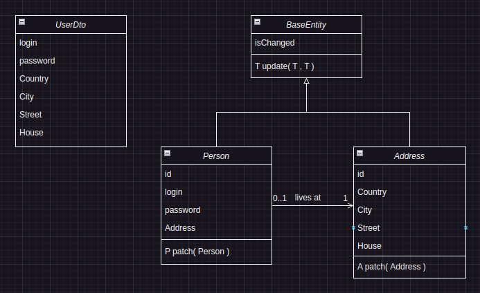
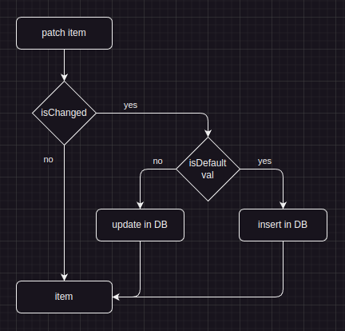

## Accidents [Job4j.ru](http://Job4j.ru)

### REST, SECURITY 
[](https://github.com/mi1qw/job4j_auth/actions/workflows/maven.yml)
[](https://www.jetbrains.com/idea/)


#### RestFul, Spring boot security JWT

Methods Get, Post, Put, Patch, Delete в контроллере.

Patch получает `userDTO`, обновляя базу данных.

***
DTO разбивается на два отдельных объекта


<p align="center">
    
</p>

Сохраняется в базе с учётом записи по умолчанию

<p align="center">
  
</p>


***
### Запуск проекта
создайте базу _fullstack_auth_ через терминал PostgreSQL<br>
```sh
$ sudo -u postgres psql
$ create database fullstack_auth
$ \q
```
запуск
```sh
$ mvn spring-boot:run
```

***
Контакты<br>
Email: my@gmail.com